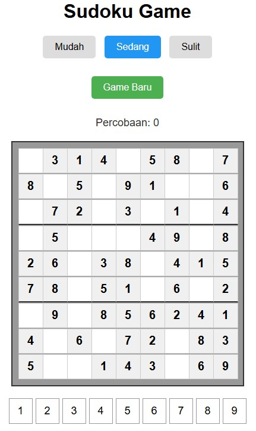

# 🎮 Sudoku Game

Implementasi permainan Sudoku dalam dua versi - CLI (Command Line Interface) dan Web berbasis HTML. Game ini dibangun menggunakan JavaScript dengan fitur lengkap permainan Sudoku klasik.

## 📝 Deskripsi

Sudoku adalah permainan teka-teki angka berbasis logika. Tujuannya adalah mengisi grid 9×9 dengan angka 1-9 sehingga setiap baris, kolom, dan kotak 3×3 berisi semua angka dari 1 hingga 9 tanpa pengulangan.

### ✨ Fitur Utama

- 3 level kesulitan (Mudah, Sedang, Sulit)
- Validasi input secara real-time
- Penghitung percobaan
- Generator papan Sudoku otomatis
- Sistem pengecekan solusi
- Interface yang user-friendly

## 🚀 Versi yang Tersedia

### 1. Versi CLI (Command Line Interface)
File: `sudoku-cli.js`

Versi terminal yang dapat dijalankan menggunakan Node.js dengan fitur:
- Input melalui command line
- Tampilan papan ASCII
- Interaksi berbasis text
- Cocok untuk penggunaan server-side

### 2. Versi Web (HTML)
File: `index.html`

Versi web dengan interface grafis yang memiliki:
- UI yang interaktif dan responsif
- Sistem drag & drop untuk input angka
- Highlight sel yang dipilih
- Feedback visual untuk input yang valid/invalid
- Tombol kontrol game yang mudah digunakan

## 🛠️ Teknologi yang Digunakan

- JavaScript (ES6+)
- HTML5
- CSS3
- Node.js (untuk versi CLI)

## 📦 Cara Instalasi

1. Clone repository ini: 

bash
git clone [https://github.com/Sulqwerty/Sudoku.git](https://github.com/Sulqwerty/Sudoku.git)
cd sudoku-game

2. Untuk versi CLI:

bash
node sudoku-cli.js

3. Untuk versi Web:
- Buka file `index.html` di browser
- Atau gunakan live server:

bash
npx live-server

## 🎯 Cara Bermain

### Versi CLI:
1. Jalankan program menggunakan Node.js
2. Pilih level kesulitan
3. Input koordinat (baris dan kolom) yang ingin diisi
4. Masukkan angka (1-9)
5. Ulangi sampai papan terselesaikan

### Versi Web:
1. Pilih level kesulitan dengan mengklik tombol level
2. Klik sel yang ingin diisi
3. Klik angka pada number pad untuk mengisi sel
4. Gunakan tombol "Game Baru" untuk memulai permainan baru

## 🎮 Demo

### Versi CLI

### Versi Web

## 🙏 Keterangan

- Terinspirasi dari permainan Sudoku klasik project https://github.com/sr-tamim/sudoku-c-program
- Menggunakan algoritma backtracking untuk generator puzzle
- UI/UX design terinspirasi dari berbagai implementasi Sudoku modern
